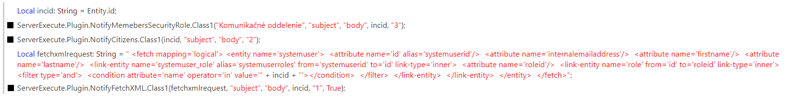

# SendNotifications plugin
This document describes how to set up 
- NotifyMembersSecurityRole
- NotifyCitiziens
- NotifyFetchXML

## Instructions
1. Create entity [`emailnotify`]
2. Add attributes
	
    -[`emailaddress1`] 		(single line text)
	
    -[`body`] 			(single line text)
	
    -[`incident_lookup`]	(lookup; add lookup target to incident)
     
    -[`userid_lookup`]	(lookup; add lookup target to account and user)
    
    -[`notificationtype`]	(optionset; 1=email, 2=push, 3=both)
3. Add attribute to Incident [incident] entity

    -[`primary_incident`]	(lookup; add lookup target to incident)
4. Add plugin to your organization 

    -download .zip files from this repository (`SendNotifications.zip`)
    
    -add -zip file to your organization
5. Add bellow commands to your process (Incident changed)
    
    NotifyCitizens([`incidentid`], [`subject`] , [`body`] ,[`Type(1=email, 2=push, 3=both)`])
    
    -[`incidentid`] -primaryincidentid

    NotifyMembersSecurityRole([`nameOfSecurityRole`] , [`subject`] , [`body`] , [`incidentid`] , [`Type(1=email, 2=push, 3=both)`] )
        
    -[`nameOfSecurityRole`] e.g. Schedule Manager
        
    NotifyFetchXML([`fetchXML`] , [`subject`] , [`body`] , [`incidentid`] , [`Type(1=email, 2=push, 3=both)`] , [`isuser`] )
        
    -[`fetchXML`] - fetchxml request
    -[`isuser`] - is request for users? => true; is request for account? => false

*Note: It is necessary to define incidentid as in the image below (create local string)*

6. Create new process for sending notifications

    -this process will start, when new record is created (`NotifyCitizens` , `NotifyMembersSecurityRole` or `NotifyFetchXML` created new record in backend)

7. Congratulations, everything should work now.
