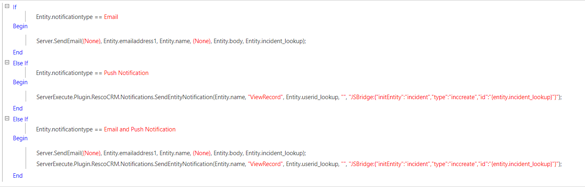

# Send Emails plugin
This document describes how to set up SendEmailsToMemebersSecurityRole.
## Instructions
1. create entity [`emailnotify`]
2. add attribute
	
    -[`subject`] 		(single line text)
	
    -[`body`] 			(single line text)
	
    -[`incident_lookup`]	(lookup; add lookup target to incident)
3. Add plugin - SendEmailsToMembersSecurityRole 

    -download .zip file from this repository
    
    -add -zip file to your organization
4. Add bellow commands to your process (Incident changed)
    
    Plugin.SendSendEmailsToMemebersSecurityRole([`nameOfSecurityRole`] , [`subject`] , [`body`] , [`incidentid`] )
        
    -[`nameOfSecurityRole`] e.g. Schedule Manager

*Note: It is necessary to define incidentid as in the image below (create local string)*

5. Create new process for sending the emails

    -this process will start, when new record is created (`SendSendEmailsToMemebersSecurityRole` created new record in backend)

6. Congratulations, everything should work now.
